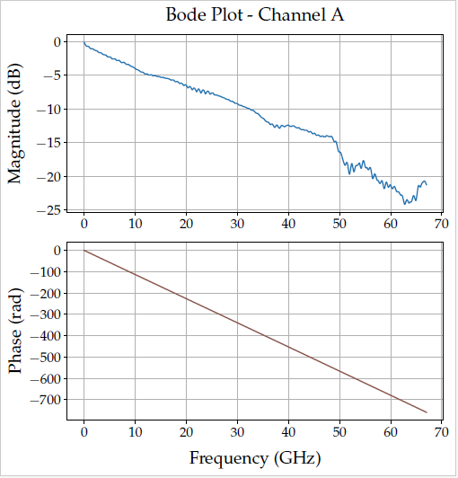
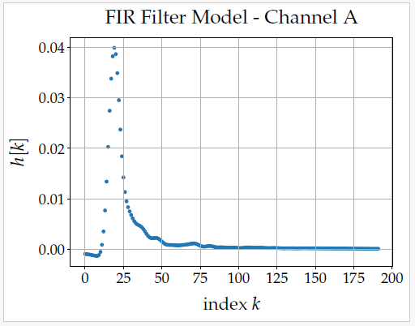
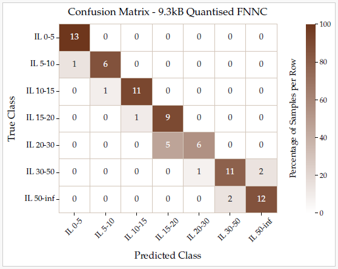

# Master's Thesis: Modeling Channels as FIR Filters from S-Parameter Data, and Training Machine Learning Models

Code independently developed during master's thesis internship. Channels were first modeled as FIR filters for implementation in SerDes simulation, using 4-port S-parameter data (Touchstone files .s4p). 

A dataset was then constructed to train machine learning models to predict channel insertion loss from simulation data. The ML model target was a small and quantized Feedforward Neural Network for implementation in C-based firmware.

Code missing due to company restrictions.